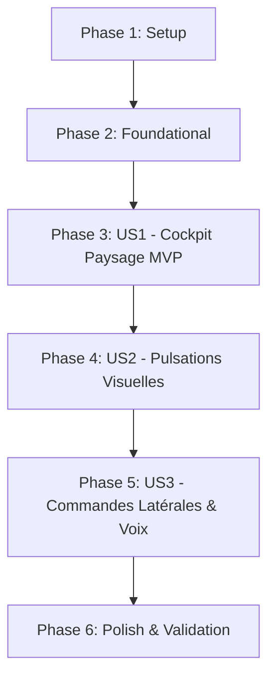

# Tasks: Amélioration Ergonomique UI et UX Cockpit

**Branch**: `001-lioration-ergonomie-ui` | **Spec**: [spec.md](file:///c:/xampp/htdocs/VELO/specs/001-lioration-ergonomie-ui/spec.md) | **Plan**: [plan.md](file:///c:/xampp/htdocs/VELO/specs/001-lioration-ergonomie-ui/plan.md)

---

## Phase 1: Setup (Shared Infrastructure)

**Purpose**: Configuration des utilitaires graphiques et dépendances UI

- [X] T001 [P] Create full-screen utility helpers in src/utils/fullscreen.ts
- [X] T002 [P] Define UI view contracts and zone color theme helpers in src/types/uiTheme.ts

---

## Phase 2: Foundational (Blocking Prerequisites)

**Purpose**: Préréquis d'affichage et composants graphiques de base

- [X] T003 [P] Implement Neon SVG circular arc component with Coggan zone glowing halos in src/components/cockpit/NeonArcGauge.tsx
- [X] T004 [P] Implement unit tests for NeonArcGauge and zone calculations in src/components/cockpit/__tests__/NeonArcGauge.test.tsx
- [X] T005 [P] Implement Visual Pulse Overlay component with dynamic zone glow in src/components/cockpit/VisualPulseOverlay.tsx
- [X] T006 Add Fullscreen toggle action and state management in src/components/common/Header.tsx

**Checkpoint**: Composants visuels de base prêts et testés.

---

## Phase 3: User Story 1 - Cockpit Panoramique Paysage & Plein Écran (Priority: P1) 🎯 MVP

**Goal**: Offrir un affichage horizontal panoramique haute lisibilité (style Garmin Edge / Wahoo) sans scroll vertical sur Pixel 10.

**Independent Test**: Ouvrir l'application en mode paysage, vérifier que les jauges néon de Watts et Cadence s'affichent à gauche en XXL et la timeline à droite sans aucun défilement.

### Tests for User Story 1
- [X] T007 [P] [US1] Unit test for landscape layout mode switch and gauge responsiveness in src/components/cockpit/__tests__/LiveCockpitLandscape.test.tsx

### Implementation for User Story 1
- [X] T008 [US1] Integrate NeonArcGauge into PowerZoneGauge.tsx and CadenceTargetGauge.tsx in src/components/cockpit/
- [X] T009 [US1] Refactor LiveCockpit.tsx to support responsive Landscape Dual-Column layout (Left: Dials, Right: Timeline & Secondary Cards) in src/components/cockpit/LiveCockpit.tsx
- [X] T010 [US1] Optimize IntervalTimeline.tsx for horizontal panoramic view in src/components/cockpit/IntervalTimeline.tsx

**Checkpoint**: Le Cockpit Paysage Plein Écran (MVP) est 100% fonctionnel et lisible à 1 mètre.

---

## Phase 4: User Story 2 - Transitions d'Intervalles avec Pulsations Visuelles (Priority: P2)

**Goal**: Accompagner le décompte sonore $T-3\text{s}$ par une pulsation lumineuse périphérique de la couleur du prochain palier.

**Independent Test**: Lancer un entraînement, vérifier le déclenchement du halo visuel lumineux synchronisé avec les 3 derniers bips avant le changement de palier.

### Implementation for User Story 2
- [X] T011 [US2] Connect workoutEngine transition countdown state to VisualPulseOverlay in src/components/cockpit/LiveCockpit.tsx
- [X] T012 [US2] Enhance visual step transition animations in src/components/cockpit/IntervalTimeline.tsx

**Checkpoint**: Les transitions d'intervalles sont dynamisées visuellement par pulsations sans vibration mécanique.

---

## Phase 5: User Story 3 - Guidage Vocal Concis & Commandes Tactiles Latérales (Priority: P3)

**Goal**: Rendre les boutons de contrôle ($\pm 5\%$, pause/saut) accessibles au pouce sur les bords latéraux et simplifier les annonces vocales.

**Independent Test**: Toucher les boutons $\pm 5\%$ sur le flanc gauche et le bouton pause sur le flanc droit en mode paysage sans lâcher les poignées.

### Implementation for User Story 3
- [X] T013 [P] [US3] Implement thumb-friendly lateral control zone component in src/components/cockpit/LateralControls.tsx
- [X] T014 [US3] Update speechCoach.ts to deliver concise audio announcements (Bloc + Watts + Durée) in src/services/audio/speechCoach.ts
- [X] T015 [US3] Integrate LateralControls into LiveCockpit.tsx in src/components/cockpit/LiveCockpit.tsx

**Checkpoint**: Pilotage tactile instantané au pouce et annonces vocales percutantes.

---

## Phase 6: Polish & Quality Assurance

**Purpose**: Validation globale, couverture de tests et compilation

- [X] T016 [P] Run and verify full Vitest test suite (`npm test`)
- [X] T017 [P] Execute production build (`npm run build`)
- [X] T018 Execute end-to-end quickstart validation per quickstart.md

---

## Dependencies & Execution Order

### Parallel Opportunities:
- T001, T002, T003, T004, T005 peuvent être développés en parallèle.
- T013 et T014 peuvent être développés en parallèle.
